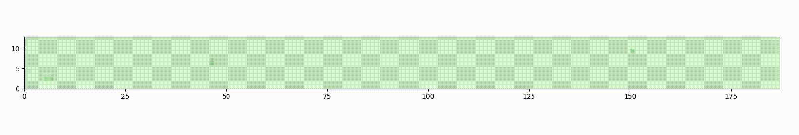
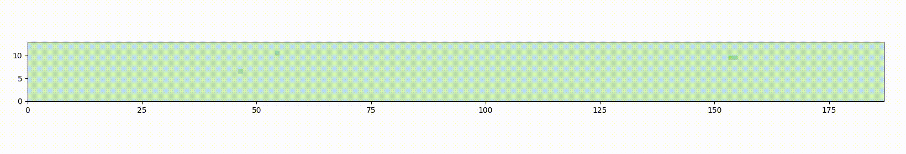

## Motor-Tubulin (MoTub) Interaction Effective Model

Here you will find the script used to simulate with a kMC algorithm a dynamic microtubule lattice with a seam structure between protofilament 0 and (m-1).

A flow of processives motors can also *effectively*  simulated. The specificity of this model is that at each step the motor will locally and transitory destabilize the dimer under its front-head. This pertubation impacts the binding energy of the dimer and increase its probability to escape from the lattice. 
The impact of the motor is directly integrated in the probability of dimer detachment. This is possible thanks to the use of tabulated values for specific motor type (ie. kinesin-1 and yeast dynein) and at specific motor density.
Theses tabulated values are : 
1. motor density 
2. probability of detachable and non-excited dimer far away from defect
3. probability of detachable excited dimer far away from defect
4. probability of detachable and non-excited dimer at the upstream of a defect
5. probability of detachable and excited dimer at the upstream of a defect

The effective model holds only if the motor velocity is way higher than tubulin dynamics. 
Therefore this model is only suitable for simulating fracture and tubulin renewal dynamics in presence of kinesin-1 or yeast dynein.

## Code color

- dark green  = GDP-tubulin dimer
- light green = GTP-tubulin dimer
- greyish site = lattice defect

## Dynamic animations 

### Tubulin renewal without motor 

### Tubulin renewal with kinesin-1

### Tubulin renewal with yeast dynein

## Reactions List 

1. dimer nucleotide hydrolysis, enabled if GTP-dimer has a neighbor above (ie. direction +)
2. GTP-dimer attachment, enable for any defect with at least one non-vacant neighbor without a motor upstream can be incorporated with a GTP-tubulin but a defect surrounding by GDP-dimer cannot repair
3. effective dimer detachment far away from defect
4. effective dimer detachment with defect upstream 
5. effective dimer detachment with defect downstream 

