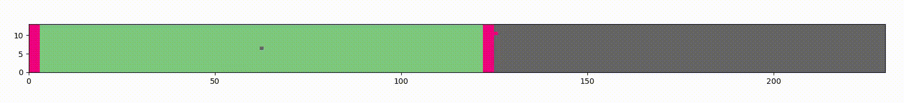
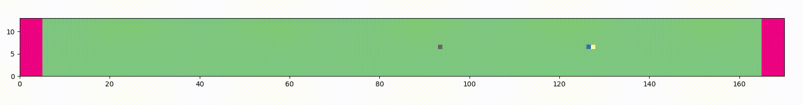

## Motor-Tubulin (MoTub) Interaction Model

Here you will find the script used to simulate with a kMC algorithm a dynamic microtubule lattice with a seam structure between protofilament 0 and (m-1).

A flow of processives motors can also fully simulated. The specificity of this model is that at each step the motor will locally and transitory destabilize the dimer under its front-head. This pertubation impacts the binding energy of the dimer and increase its probability to escape from the lattice. 

Dependant on the lattice initial configuration, different scenarios can be emulate with this model:
- "growth" = the lattice begins by only a polymerizing seed of 6 dimers height
- "shrink" = the lattice has a lenght noted L, without a GTP-cap which triggers the shrinking phase
- "fracture" = the lattice is stabilized at its both ends by GMPCPP-tubulins, with a initial defect along its length

## Code color

- blue motors = kinesin (100 sites/s)
- orange motors = yeast dynein (10 sites/s)
- green lattice = GDP-tubulin dimer
- pink lattice = GTP-tubulin dimer
- grey site = lattice defect

## Dynamic animations 

### Dynamic Instabilities with a small density of kinesin-1 with defect along its length

### Fracture in presence of motors 

## Reactions List 

1. motor attachment, enabled if 2 adjacent sites are vacant
2. motor detachment, enabled for any 2-head motor 
3. modified motor detachment, enabled for any 1-head motor (ie. next to a defect)
4. motor walk, enabled if next site is vacant (ie. no motor)
5. dimer nucleotide hydrolysis, enabled if GTP-dimer has a neighbor above (ie. direction +)
6. GTP-dimer attachment, enable for any defect with at least one non-vacant neighbor without a motor upstream can be incorporated with a GTP-tubulin but a defect surrounding by GDP-dimer cannot repair
7. dimer relaxation, enabled if the dimer is in excited state due to motor walk
8. dimer detachment for non-destabilized dimer
9. dimer detachment for destabilized dimer

