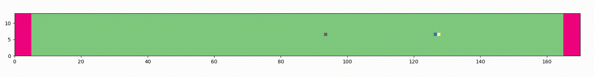

## Example kMC simulation of a microtubule fracture in presence of kinesins-1

---

## A simple model for Motor-Tubulin interaction

Microtubules are key structural elements of living cells that are crucial for cell division, intracellular transport and motility. Due to their important role in cell division, microtubules represent a primary target for cancer related drugs.

Microtubules are slender tubular structures with a diameter of 25\,nm and up to several tens of $mu$m long. They grow and shrink at their extremities and are subject to a non-equilibrium phenomenon called dynamic instability that consists of alternating phases of slow growth and rapid collapse.

This behavior results from the irreversible hydrolysis of GTP upon integration of GTP-tubulin into the microtubule lattice.

For three decades, a substantial effort in microtubule research has been dedicated to the study of the dynamic instability at the microtubule tips. In contrast, only little is known about the dynamical properties and the structural integrity of the microtubule shaft.

It has been known for a long time that so called Microtubule Associated Proteins (MAPs) may interact with the microtubule lattice, impacting its overall stability and the tip dynamics. 
Recent experiments have shown that microtubule severing proteins and molecular motors stimulate the direct and localized incorporation of free GTP-tubulin into the microtubule shaft, suggesting that the microtubule shaft is subject to localized plastic events apparently without compromising the overall mechanical integrity of the microtubule. It has been suggested that sites of lattice plasticity in dynamic microtubules serve as rescue sites, i.e. they stimulate the transition from microtubule shrinkage to elongation, thereby impacting the global microtubule stability.  However, little is known about a potential mechanisms of lattice plasticity and to which extend MAPs stimulate or slow down this process. 

Within the framework of my PhD thesis, I developed a theoretical and numerical description of the interaction of processive motors with the microtubule lattice, called the MoTub model. 
Based on a kinetic Monte Carlo approach, this model is composed of a set of reactions for tubulin dimers (attachment, detachment, nucleotide hydrolysis) and for processive motors (attachment, walking, detachment) that are widely accepted in the scientific literature.
The model is completed with a motor-lattice interaction: The irreversible motor step along the microtubule transiently "excites" the underlying tubulin lattice, inducing a short-lived slightly less stable ("excited") lattice conformation.

In this mechanism, a weak and transient destabilization of the lattice by the motor stepping promotes the formation of mobile vacancies. In the absence of free GTP-tubulin the defect rapidly propagates leading to a complete microtubule fracture. In the presence of free GTP-tubulin, the motor walk induces a vacancy drift in the direction opposite of the motor walk. The drift is accompanied by the direct and localized incorporation of free GTP-tubulin along the trajectory of the vacancy. These results are consistent with recent experiments in the literature and strongly suggest that a weak lattice-motor interaction is responsible for an augmented microtubule shaft plasticity.

Within this repo, you will find all the source code used to conduct the numerical simulation. 
You are free to use it at will. 
